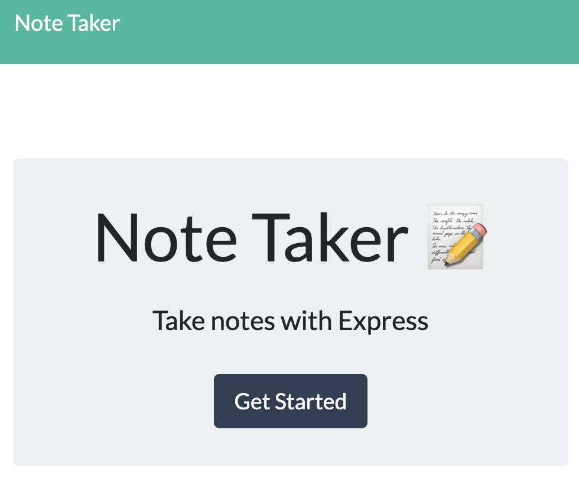

#  Note Taker

### [Deployed](https://boiling-eyrie-32722.herokuapp.com/notes) Site

 

 Final Product Preview
 

    

    
## Summary & Process
For this project, our objective was to create an app that allows the user to save and delete notes and stores their responses in a server.

I began by establishing the layout for the server.js and followed it by filling in the create.js file. However, a good amount of time was spent rearranging file structures to make sure that all pieces were accounted for. I made sure to include all functional elements as well as separating my routes into a separate file structure as well as separating the add and remove note functions from the server.js file. 
_______
## Table of Contents

* [Technologies Used](#technologies_used)

* [Contact](#contact)

## Generated Page - Screen Shots 
Note Taker Page 

    

Home Page

    

 

## Technologies_Used

- Node.js /  Javascript / ES6 
- NPM / Express
- Visual Studio Code
- Heroku
- Git / GitHub / GitPage

## Contact & Connect

* [Colin Whitcomb](https://github.com/Colin-Whitcomb)
* [LinkedIn](https://www.linkedin.com/in/colin-whitcomb-b808301a6/)
* [Portfolio](https://colin-whitcomb.github.io/Portfolio/)